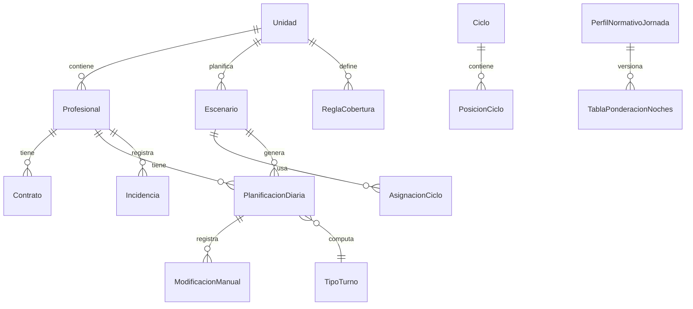

# Modelo de datos

## Principios

- Un unico modelo local sustituye los dos libros.
- Todo dato calculado relevante conserva origen.
- Las reglas normativas son datos versionados.
- Los codigos no se hardcodean.
- La persistencia final sera IndexedDB.
- Las exportaciones JSON deben poder restaurar un escenario completo.

## Entidades

### Unidad

Representa hospital, unidad o servicio.

Campos:

- `id`.
- `nombre`.
- `hospital`.
- `servicio`.
- `categoriaPrincipal`.
- `activa`.
- `observaciones`.

### Profesional

Campos:

- `id`.
- `identificadorInterno`.
- `nombreCompleto`.
- `categoria`.
- `unidadId`.
- `activo`.
- `observaciones`.

No incluir por defecto DNI, telefono, direccion ni fecha de nacimiento.

### Contrato

Campos:

- `id`.
- `profesionalId`.
- `unidadId`.
- `fechaInicio`.
- `fechaFin`.
- `porcentajeJornada`.
- `modalidadTurno`: `diurno`, `nocturno`, `rotatorio`, `otro`.
- `perfilNormativoJornadaId`.
- `reducciones`.
- `observaciones`.

### TipoTurno

Campos:

- `id`.
- `codigo`.
- `denominacion`.
- `horaInicio`.
- `horaFin`.
- `duracionMinutos`.
- `minutosComputables`.
- `grupoCobertura`: `manana`, `tarde`, `noche`, `diurno12`, `nocturno12`, `refuerzo`, `otro`.
- `cruzaMedianoche`.
- `color`.
- `activo`.
- `version`.

### Ciclo

Campos:

- `id`.
- `unidadId`.
- `nombre`.
- `descripcion`.
- `duracionDias`.
- `activo`.
- `creadoEn`.
- `actualizadoEn`.

### PosicionCiclo

Campos:

- `id`.
- `cicloId`.
- `posicion`.
- `tipoTurnoId`.
- `nota`.

### AsignacionCiclo

Campos:

- `id`.
- `escenarioId`.
- `profesionalId`.
- `contratoId`.
- `cicloId`.
- `fechaInicioCiclo`.
- `desfase`.
- `fechaInicioAplicacion`.
- `fechaFinAplicacion`.

### PlanificacionDiaria

Campos:

- `id`.
- `escenarioId`.
- `profesionalId`.
- `contratoId`.
- `fecha`.
- `turnoPrevistoId`.
- `turnoManualId`.
- `incidenciaId`.
- `turnoComputadoId`.
- `origen`: `ciclo`, `manual`, `incidencia`, `importado`.
- `horasProgramadasMin`.
- `horasTrabajadasMin`.
- `horasComputablesMin`.
- `presenciaAsistencial`.
- `requiereSustitucion`.
- `estadoValidacion`.

### ModificacionManual

Campos:

- `id`.
- `planificacionDiariaId`.
- `escenarioId`.
- `fecha`.
- `profesionalId`.
- `valorAnterior`.
- `valorNuevo`.
- `motivo`.
- `usuarioLocal`.
- `creadoEn`.

### Incidencia

Campos:

- `id`.
- `escenarioId`.
- `profesionalId`.
- `tipoIncidenciaId`.
- `fechaInicio`.
- `fechaFin`.
- `turnoPrevistoConservado`.
- `observaciones`.

### TipoIncidencia

Campos:

- `id`.
- `codigo`.
- `denominacion`.
- `activo`.
- `color`.
- `reglaComputo`.

### PerfilNormativoJornada

Campos:

- `id`.
- `nombre`.
- `vigenteDesde`.
- `vigenteHasta`.
- `jornadaDiurnaMin`.
- `jornadaNocturnaMin`.
- `jornadaRotatoriaReferenciaMin`.
- `nochesReferencia`.
- `fuente`.
- `estadoValidacion`.

### TablaPonderacionNoches

Campos:

- `id`.
- `perfilNormativoJornadaId`.
- `vigenteDesde`.
- `vigenteHasta`.
- `filas`: noches -> jornada minutos.
- `fuente`.
- `estadoValidacion`.

### ReglaCobertura

Campos:

- `id`.
- `unidadId`.
- `escenarioId`.
- `vigenteDesde`.
- `vigenteHasta`.
- `tipoDia`: `laborable`, `sabado`, `domingo`, `festivo`, `diaSemana`.
- `diaSemana`.
- `grupoCobertura`.
- `minimo`.
- `maximoDeseado`.
- `observaciones`.

### Escenario

Campos:

- `id`.
- `unidadId`.
- `anio`.
- `nombre`.
- `tipo`: `oficial`, `simulacion`, `archivo`.
- `origenEscenarioId`.
- `bloqueado`.
- `creadoEn`.
- `actualizadoEn`.

### Festivo

Campos:

- `id`.
- `unidadId`.
- `anio`.
- `fecha`.
- `nombre`.
- `ambito`: `nacional`, `autonomico`, `local`, `unidad`.
- `activo`.

### RegistroAuditoria

Campos:

- `id`.
- `entidad`.
- `entidadId`.
- `accion`.
- `antes`.
- `despues`.
- `usuarioLocal`.
- `fechaHora`.
- `escenarioId`.

## Relaciones principales



## Ejemplos JSON

### TipoTurno

```json
{
  "id": "turno-M",
  "codigo": "M",
  "denominacion": "Manana",
  "horaInicio": "08:00",
  "horaFin": "15:00",
  "duracionMinutos": 420,
  "minutosComputables": 420,
  "grupoCobertura": "manana",
  "cruzaMedianoche": false,
  "color": "#3b82f6",
  "activo": true,
  "version": 1
}
```

### Ciclo

```json
{
  "id": "ciclo-rotatorio-9",
  "unidadId": "unidad-uci",
  "nombre": "Rotatorio 9 dias",
  "duracionDias": 9,
  "posiciones": [
    {"posicion": 1, "tipoTurnoId": "turno-M"},
    {"posicion": 2, "tipoTurnoId": "turno-M"},
    {"posicion": 3, "tipoTurnoId": "turno-T"},
    {"posicion": 4, "tipoTurnoId": "turno-T"},
    {"posicion": 5, "tipoTurnoId": "turno-N"},
    {"posicion": 6, "tipoTurnoId": "turno-N"},
    {"posicion": 7, "tipoTurnoId": "turno-L"},
    {"posicion": 8, "tipoTurnoId": "turno-L"},
    {"posicion": 9, "tipoTurnoId": "turno-L"}
  ]
}
```

### PlanificacionDiaria

```json
{
  "id": "pd-2026-01-15-prof-001",
  "escenarioId": "esc-2026-oficial",
  "profesionalId": "prof-001",
  "contratoId": "contrato-001",
  "fecha": "2026-01-15",
  "turnoPrevistoId": "turno-M",
  "turnoManualId": null,
  "incidenciaId": null,
  "turnoComputadoId": "turno-M",
  "origen": "ciclo",
  "horasProgramadasMin": 420,
  "horasTrabajadasMin": 420,
  "horasComputablesMin": 420,
  "presenciaAsistencial": true,
  "requiereSustitucion": false,
  "estadoValidacion": "ok"
}
```

### PerfilNormativoJornada

```json
{
  "id": "perfil-2019-base",
  "nombre": "SESCAM desde 2019",
  "vigenteDesde": "2019-01-01",
  "vigenteHasta": null,
  "jornadaDiurnaMin": 91140,
  "jornadaNocturnaMin": 87000,
  "jornadaRotatoriaReferenciaMin": 89460,
  "nochesReferencia": 42,
  "fuente": "Requisito funcional pendiente de cotejo documental",
  "estadoValidacion": "pendiente_pdf"
}
```

### ReglaCobertura

```json
{
  "id": "cob-uci-laborable-manana",
  "unidadId": "unidad-uci",
  "escenarioId": "esc-2026-oficial",
  "tipoDia": "laborable",
  "grupoCobertura": "manana",
  "minimo": 3,
  "maximoDeseado": null,
  "vigenteDesde": "2026-01-01",
  "vigenteHasta": null
}
```
